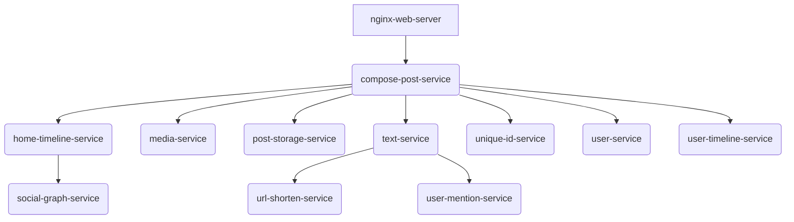

# System Architecture and Monitoring Stack

This document provides a detailed overview of the social network's architecture and the comprehensive monitoring stack integrated for performance analysis.

## Application Architecture

The DeathStarBench social network is a complex application composed of numerous microservices that communicate with each other using Thrift RPCs. [cite: 29, 907] The system is deployed using Docker Compose, which orchestrates the startup and networking of all services. [cite: 661]

The core services include:
* **Frontend Services:** `nginx-web-server` for routing and a media frontend. [cite: 39]
* **Core Logic:** Services for managing users, posts, social graphs, and timelines. [cite: 40, 41, 42, 43]
* **Helper Services:** Services for media, text processing, URL shortening, and user mentions. [cite: 44, 45, 46, 47]
* **Databases:** MongoDB and Redis for data persistence and caching. [cite: 48]

## Monitoring Stack

To achieve full observability, we integrated a monitoring stack with the following components:

| Component         | Purpose                                         | Port  | Dependencies      |
| ----------------- | ----------------------------------------------- | ----- | ----------------- |
| **Prometheus** | Metrics collection, storage, and alerting. [cite: 663, 790, 916]      | `9090`  | -                 |
| **Grafana** | Interactive visualization dashboards. [cite: 663, 790, 916] | `3000`  | Prometheus, Jaeger |
| **cAdvisor** | Container resource (CPU, memory) monitoring. [cite: 664, 790, 916]    | `8081`  | Prometheus        |
| **Jaeger** | Distributed tracing for request flows. [cite: 664, 790, 916]          | `16686` | Prometheus        |
| **Blackbox Exporter** | Probes for external service health checks (TCP). [cite: 665, 790, 916] | `9115`  | Prometheus        |

## System Flowchart

The following diagram illustrates the flow of a `Compose Post` request, showing how the `nginx-web-server` routes the request to the `compose-post-service`, which then communicates with various downstream microservices.

